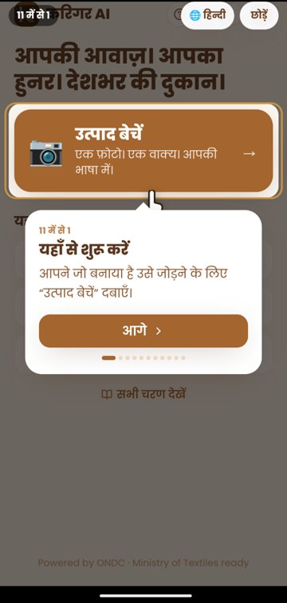
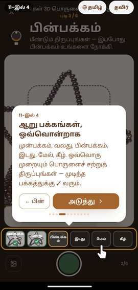
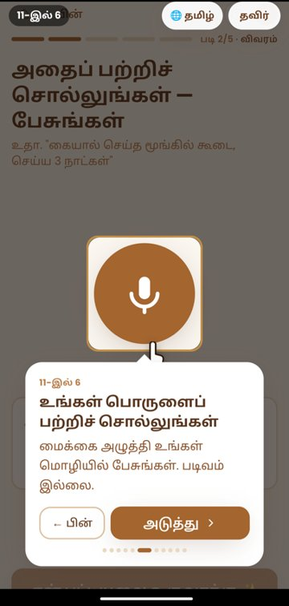

<div align="center">

# 🧺 Karigar AI

### Your voice. Your craft. A national storefront.

**An AI co-seller for India's 7 million artisans.**
Six photos and one spoken sentence, in the artisan's own language, become a
verified, fairly priced, 3D-ready product page live on ONDC.

**[▶ Open the live app](https://karigar-ai-sigma.vercel.app)** · [Backend API](https://karigar-ai-backend-9kwi.onrender.com/api/health) · [Architecture](docs/ARCHITECTURE.md) · [Demo script](docs/DEMO_SCRIPT.md)

[](https://github.com/gd23456/SIH2026/actions/workflows/ci.yml)
[](https://karigar-ai-sigma.vercel.app)
[](LICENSE)
[](https://www.python.org/)
[](https://react.dev/)
[](frontend/src/lib/i18n.js)
[](#built-to-survive-demo-day)

**Smart India Hackathon 2026 · Problem Statement SIH26090**
*AI-Driven Market Linkage & Smart Cataloging Mobile Application for Marginalized Artisans*





<sub>The first-run tour runs on the app's real screens, shown here in Hindi and Tamil.</sub>

</div>

---

## The problem

India has around **7 million artisans**. Almost none of them sell online.

The craft is good enough. What stops them is that selling online demands
three things they were never given: **product photography**, **English
copywriting** and **market pricing knowledge**. So a middleman does it, and
takes up to **60%** of what the work is worth.

Every existing solution builds another *marketplace*, which solves the
**buyer** side for sellers who can already list. Karigar AI solves the
**seller** side: the reason an artisan can't get onto a marketplace in the
first place.

---

## Try it in 30 seconds

1. Open **[karigar-ai-sigma.vercel.app](https://karigar-ai-sigma.vercel.app)** on a phone.
2. Pick a language, then take the 11-step tour, or skip it.
3. Tap **Skip for now (demo)** to explore without an account.
4. Tap **Sell a product → Start 6-photo capture** and photograph something from six sides.

> The backend runs on Render's free tier, so the first request after it has
> been idle can take 30–60 seconds. If the backend has no Gemini key it
> answers with **clearly flagged sample text**, and the app won't publish that
> text until the artisan edits it.

---

## What an artisan does and what the AI does

| | Step | What happens |
|---|---|---|
| 🎓 | **Tour** | An 11-step tutorial on the *real* screens: spotlight, pointer, in any of 9 languages, switchable mid-tour. Shown before sign-in. |
| 🧊 | **6-angle capture** | A guided camera for FRONT → RIGHT → BACK → LEFT → TOP → BOTTOM, with a product outline and on-device checks for blur, light, framing, centring and "you already took this side". It advises; it never blocks. |
| 📷 | **Catalogue photo** | The FRONT shot is background-cleaned and studio-lit. |
| 🧊 | **Real 3D model** | The six photos are reconstructed into a GLB, viewable with rotate, zoom, pan, full screen and AR in the app *and* on the buyer's storefront. |
| 🎙️ | **Voice** | The artisan speaks naturally in **9 Indian languages**. No forms, no English. |
| ✍️ | **Catalogue** | Title, story, materials, technique and search tags. Every field is labelled **AI-written · Your words · Verified · Pending verification**, and everything is editable. |
| ✓ | **Verified GI** | Matched against **~160 registered Geographical Indications**. A registry match earns a green badge and a price premium; an LLM guess stays "pending". |
| ⚖️ | **Fair price** | Market median from comparable listings, plus a skill and GI premium, **never below a fair-wage floor** (₹400 per working day). Every line is shown. |
| 🎬 | **Product video** | A 7-second 9:16 promo video rendered *on the phone* (MP4), for WhatsApp Status and Instagram. |
| 🔎 | **Final review** | The product page exactly as buyers will see it. Publishing needs an explicit "I've checked this". |
| 🚀 | **Publish** | An ONDC RET10 catalog, a public storefront page, a QR code and a shareable **product card** with price and QR. |
| 🛒 | **Buyer view** | Search the published catalogue and find the item that was just created. |

**Result:** an artisan who has never typed a word of English is sellable
nationwide, with a 3D view, in a few minutes.

---

## What makes it different

- **Seller-side, voice-first.** It's built for people who can't type a listing, not for people who already sell online.
- **Verified, not guessed.** GI status comes from a registry and prices from market comparables with a wage floor. AI output is labelled as AI output.
- **Honest by construction.** Offline fallback text is flagged and blocked from publishing, a failed publish is *queued*, never faked, and the dev 3D model is labelled "Test model" everywhere.
- **Offline-first.** Drafts, photos and publishes survive app closure and bad networks, and sync themselves when the connection returns.
- **Free, self-hostable 3D.** Hunyuan3D-2mv runs on an Apple Silicon Mac, so there's no per-model API bill and product photos never leave your own hardware.

---

## Run it locally

**No API key required.** Without keys, every AI step falls back to
keyword-aware mock output, so the whole flow works on any laptop.

```bash
git clone https://github.com/gd23456/SIH2026.git && cd SIH2026
make setup

make backend     # terminal 1 → http://localhost:8000
make frontend    # terminal 2 → http://localhost:5173
```

<details>
<summary><b>Manual setup, or Windows</b></summary>

```bash
# Backend
cd backend
python3.11 -m venv .venv && source .venv/bin/activate    # Windows: .venv\Scripts\activate
pip install -r requirements.txt
cp ../.env.example .env
uvicorn app.main:app --reload --host 0.0.0.0 --port 8000

# Frontend (new terminal)
cd frontend && npm install && npm run dev
```

Optional: real neural background removal (Python 3.11):

```bash
pip install -r backend/requirements-ai.txt      # or: make setup-ai
```
</details>

<details>
<summary><b>Real 3D models on your own machine (free)</b></summary>

The 3D worker in [`model3d_server/`](model3d_server/README.md) runs
**Tencent Hunyuan3D-2mv** and colours the mesh from the artisan's six photos.
It's tested on an **M4 Mac with 16 GB**: about 1.5 minutes per model, about
7 GB peak memory and about 7 GB of disk.

```bash
# one-time setup: see model3d_server/README.md
MODEL3D_LOCAL_TOKEN=<random-secret> make model3d          # serves :8100
```

Then in `backend/.env`:

```env
MODEL3D_PROVIDER=local
MODEL3D_LOCAL_URL=http://127.0.0.1:8100
MODEL3D_LOCAL_TOKEN=<the same secret>
```
</details>

Something wrong? Run **`make doctor`**, then see [docs/SETUP.md](docs/SETUP.md).

---

## Deploy

| Part | Where | How |
|---|---|---|
| **Web app** | Vercel | `frontend/` with [`vercel.json`](frontend/vercel.json). Set `VITE_API_BASE` to the backend URL; the service worker and SPA rewrites are already configured. |
| **Backend** | Render (or any Python host) | `uvicorn app.main:app` from `backend/`. Set the variables below; use a persistent disk for `MEDIA_DIR` and `DATABASE_URL`. |
| **3D worker** | Any Mac with 16 GB+, or an NVIDIA GPU box | `make model3d`, reachable from the backend at `MODEL3D_LOCAL_URL`. |
| **Android** | APK / Play Store | See [Run on Android](#run-on-android). |

### Configuration

| Variable | Default | Purpose |
|---|---|---|
| `GEMINI_API_KEY` | – | Real listing text and pricing. Without it, output is mock and flagged. |
| `APP_ENV` | `development` | `production` refuses development-only providers such as the test 3D model. |
| `MODEL3D_PROVIDER` | auto | `local` · `meshy` · `mock` · `disabled`. Blank means `meshy` if a key is set, otherwise `disabled`. Never silently `mock`. |
| `MODEL3D_LOCAL_URL` / `_TOKEN` | – | Your Hunyuan3D worker and its shared secret. |
| `MESHY_API_KEY` | – | Hosted alternative (paid, about 30 credits per model). |
| `MODEL3D_RETENTION_DAYS` | `7` | Photos and models of never-published products are deleted after this. |
| `MEDIA_DIR` | `./media` | Uploaded views and generated models. |
| `PUBLIC_BASE_URL` | derived | Storefront and QR links. Leave blank on a laptop hotspot so they follow the request host. |
| `CORS_ORIGINS` | localhost | Allowed web origins. |

Full list with comments: [`.env.example`](.env.example).

---

## Run on Android

`frontend/android/` is a real native project with a native `SpeechRecognizer`,
the live camera, and the native share sheet and file save. It renders the built
web app, so **the build order matters**:

```bash
cd frontend
npm run build && npx cap sync android    # ← sync is the step everyone forgets
cd android && ./gradlew assembleDebug    # needs JDK 17–21
```

📖 [docs/BUILD_ORDER.md](docs/BUILD_ORDER.md) has exact versions, checks after
every stage, and how to get a phone talking to your laptop.

| Setup | Backend URL |
|---|---|
| Emulator | `http://10.0.2.2:8000` (automatic) |
| Real device, same network | `http://<laptop-IP>:8000`, set in-app under **Profile → Connection** |
| Demo day | Put the laptop on the **phone's hotspot**. Venue Wi-Fi often isolates devices; hotspots don't. |

---

## Built to survive demo day

A hackathon demo runs on venue Wi-Fi, a free API tier and a borrowed phone, so
we assumed all three would fail:

```
Frontend    network failure          → drafts + photos kept on device, publish queued, auto-sync
Backend     no key / quota / error   → keyword-aware mock AI, flagged as sample text
Service     rembg missing            → studio lighting instead of cut-out
3D          worker down / job fails  → "Couldn't create your 3D view" · Try again · Continue without 3D
```

You can **unplug the network, delete the API key and uninstall rembg**, and
the flow still completes. What it never does is pretend: a publish that
didn't reach the server says so and waits for a connection.

```bash
curl http://localhost:8000/api/health
# {"status":"ok","mode":"live (Gemini)", ..., "integrations":{"gemini":"live","rembg":true,"model3d":"local"}}
```

---

## Architecture

```
┌───────────────────────────────────────────────────────────────────┐
│  ARTISAN'S PHONE — React 18 PWA · Capacitor 6 · Tailwind          │
│  Tour → 6-angle capture → Voice → Catalogue → Price → Review → Publish │
│  IndexedDB: drafts, captured photos, publish queue, owed 3D jobs  │
│  On-device: capture quality checks · MP4 product video · QR card  │
└───────────────┬───────────────────────────────────────────────────┘
                │ REST / JSON (+ multipart photo upload)
┌───────────────▼───────────────────────────────────────────────────┐
│  FastAPI backend                                                  │
│   POST /api/enhance-image     rembg U²-Net + studio composite     │
│   POST /api/generate-listing  Gemini vision + GI registry verify  │
│   POST /api/price             grounded fair-price engine          │
│   POST /api/publish           ONDC:RET10 catalog + persistence    │
│   POST /api/models            6 views → validated → 3D job        │
│   GET  /api/models/{id}       job status (device token)           │
│   GET  /api/models/{id}/model.glb   the 3D model (immutable)      │
│   GET  /p/{id}  · /api/qr/{id}      storefront page + QR          │
│   background worker ──────────┐                                   │
└───────────────────────────────┼───────────────────────────────────┘
                                │ provider interface (swappable)
        ┌───────────────────────┼─────────────────────────┐
        ▼                       ▼                         ▼
  local: Hunyuan3D-2mv     meshy: hosted API        mock: dev only
  on your Mac/GPU          (4 of 6 views)           ("Test model")
```

**Stack:** React 18 · Vite · Tailwind · Capacitor 6 · `<model-viewer>` ·
FastAPI · SQLModel · Pydantic v2 · Google Gemini · rembg (U²-Net) · Pillow ·
Tencent Hunyuan3D-2mv (PyTorch MPS/CUDA)

Full detail: [docs/ARCHITECTURE.md](docs/ARCHITECTURE.md)

---

## Project layout

```
├── backend/                  FastAPI + AI services
│   ├── app/
│   │   ├── main.py           routes
│   │   ├── services/
│   │   │   ├── model3d/      3D jobs, worker, providers (local · meshy · mock)
│   │   │   └── …             gemini · image · pricing · gi · ondc · channels
│   │   ├── db/               SQLModel tables (Listing, ModelJob, …) + repository
│   │   ├── templates/        server-rendered storefront (photos · 3D · QR)
│   │   └── static/vendor/    model-viewer (vendored for offline storefronts)
│   └── tests/                API + 3D pipeline contract tests
├── frontend/                 React PWA + Android shell
│   ├── src/components/       steps · CaptureStudio · Model3D · Tutorial · VideoStudio · Guide
│   ├── src/lib/              api · i18n (9 langs) · model3d sync · publish queue · idb · video
│   ├── vercel.json           web deployment
│   └── android/              Capacitor native project
├── model3d_server/           self-hosted Hunyuan3D-2mv worker (free 3D)
├── docs/                     setup · architecture · demo · roadmap · judge Q&A
└── Makefile                  setup · backend · frontend · model3d · doctor · demo
```

---

## Honest status

We'd rather be precise than impressive. That matters when the panel includes
ONDC and Ministry of Textiles people.

| Component | Status |
|---|---|
| Background removal + studio lighting | ✅ Real (rembg U²-Net) |
| Multilingual listing generation | ✅ Real (Gemini vision), **9 languages**; mock output is flagged and blocked from publishing unedited |
| Voice input | ✅ Real (Web Speech + native Android) |
| 6-angle guided capture + quality checks | ✅ Real, on-device, tested on Android 15 phones |
| 3D reconstruction | ✅ Real with the **local Hunyuan3D worker** (tested on an M4 Mac) or Meshy. ⚠️ Quality depends heavily on the capture; colouring is per-vertex, so fine print blurs (texture baking is next). The public demo backend has 3D **off** because the worker isn't publicly hosted. |
| 3D viewer (app + storefront) | ✅ Real (`<model-viewer>`: touch, mouse, full screen, AR) |
| Product video + product card | ✅ Real, rendered on the phone (MP4 via MediaRecorder; image-card fallback) |
| Drafts, offline publish queue, owed-3D sync | ✅ Real (IndexedDB); survives app restarts; tested with the backend down |
| Real-screen tutorial | ✅ Real, 9 languages, before sign-in |
| Grounded fair-price engine | ✅ Real: comparables + skill premium + **fair-wage floor** |
| GI-tag verification | ✅ Real: fuzzy-matched against a **~160-entry registered-GI registry**, feeds a +15% premium |
| Buyer-side search | ✅ Real (`GET /api/search`, buyer view) |
| Accounts (Google + phone OTP) | ✅ Real via Firebase; **demo-account fallback** so it never blocks |
| Multi-channel publish | ✅ **ONDC is the real channel.** Meesho/Myntra/Amazon/Flipkart/WhatsApp are clearly labelled demo adapters (no public seller API, no credential capture) |
| Plans / paid upgrade | ⚠️ Plan flag + Pro screen real; **live Google Play Billing is post-hackathon** |
| ONDC catalog | ⚠️ **Schema-correct payload, not yet POSTed to a live BPP.** Registration is an organisational step, not a technical one |

We do **not** claim to be live on ONDC. See [docs/ROADMAP.md](docs/ROADMAP.md).

---

## Why this wins

| Judge criterion | Our answer |
|---|---|
| **Real need** | 7M+ artisans; middlemen take up to 60%. The barrier is photography, language and pricing, not craft quality |
| **Clear government buyer** | Development Commissioner (Handicrafts), Ministry of Textiles, Ministry of MSME, **ONDC** |
| **Differentiation** | Voice-first, 9-language, **seller-side** AI · **3D from six phone photos** · grounded fair pricing · registry-verified GI · works offline |
| **Social impact** | The price engine has a **labour-cost floor**: it can't suggest a price below what the artisan's time is worth |
| **Trust** | Every AI claim is labelled; nothing unverified is presented as verified; nothing unpublished is shown as live |
| **Buildable** | Live on the web today; runs on a laptop with no API key; free self-hosted 3D |
| **Startup potential** | *"Shopify + ONDC for artisans, where the AI does the difficult part"* |

---

## Licences and third parties

- Karigar AI: [MIT](LICENSE).
- **Tencent Hunyuan3D-2mv** (used by `model3d_server/`): Tencent Hunyuan 3D 2.0 Community License. Commercial use is allowed; it **does not apply in the EU, UK or South Korea**; above 1M monthly users, a licence from Tencent is required. See [`model3d_server/NOTICE`](model3d_server/NOTICE). Karigar AI is not affiliated with or endorsed by Tencent.
- **`<model-viewer>`** (Google): Apache-2.0, vendored in `backend/app/static/vendor/`.
- **U²-Net** via rembg: Apache-2.0. hy3dgen's default remover (BRIA RMBG-2.0, non-commercial) is deliberately **not** used.

---

## For the team

| Doc | What's in it |
|---|---|
| [CONTRIBUTING.md](CONTRIBUTING.md) | Branch flow, PR rules, **security rules** |
| [docs/SETUP.md](docs/SETUP.md) | Every failure mode and its fix |
| [docs/BUILD_ORDER.md](docs/BUILD_ORDER.md) | Android build, step by step |
| [docs/TEAM.md](docs/TEAM.md) | Who owns which directory |
| [docs/ROADMAP.md](docs/ROADMAP.md) | What to build next, in priority order |
| [docs/DEMO_SCRIPT.md](docs/DEMO_SCRIPT.md) | The 90-second script + fallbacks |
| [docs/JUDGE_QA.md](docs/JUDGE_QA.md) | Every question we'll get, with answers |
| [model3d_server/README.md](model3d_server/README.md) | Running free 3D on your own machine |

```bash
make help      # all commands
make doctor    # diagnose setup + ping every live integration
make demo      # demo-day checklist + your LAN IP
make model3d   # start the local 3D worker
```

**Two rules:** `main` is always demoable, and **never commit an API key.**

---

<div align="center">

Built for **Smart India Hackathon 2026** 🇮🇳

*Solving the seller-side problem that keeps 7 million artisans out of e-commerce.*

</div>
